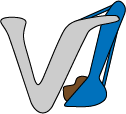

# Sam Virgona Portfolio

I am a Torquay based design student with a passion for creating meaningful visual work. I am currently studying a Bachelor of Design at Deakin University, majoring in Interactive and UX Design, minoring Animation and Motion Graphics.
I am a creative person who enjoys experimenting with different ideas, learning new techniques and finding creative solutions to problems. My goal is to continue developing and expanding my skill set, building a career where I can turn ideas into something that people connect with.

# Work

Logo for Virgona Earthmoving:

